# Friendly Lidar
## Efficient Lidar Densification via Back-Projection, Fast Hull Approximation, and Angular Interpolation

### 1. Why we do this
Lidar is becoming a more and more important type of sensor in machine perception applications, especially self-driving cars & drones. There has been concerns about its price, but recent trend has shown very positive signs of significant decrease in the manufacturing cost of Lidar.

Let me make a bold prediction: <u>Lidar will be everywhere in a few years.</u> Therefore, we need to prepare ourselves for the upcoming future.

<u>However, as far as I know of as a computer vision researcher, things becomes messy and tricky when it comes to using Lidar data.</u> Unlike an image in a strict 2-d grid, or an audio as a 1-d waveform, Lidar data is way less formatted. To give you an illustration of what I'm talking about, let's look at the following example of one frame of Lidar data:

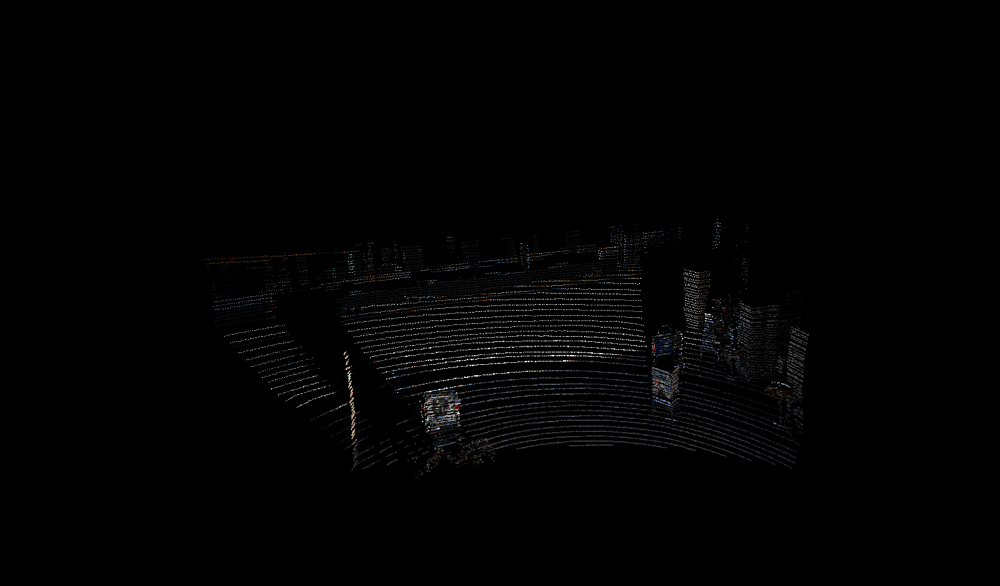

Figure 1. An example of Lidar data from the KITTI dataset, point color obtained from a calibrated and synchronized camera.

Can't really see anything, right? The reason is that Lidar data is captured as a scattered, sparse point cloud. To solve this problem in hope of making Lidar data just a little bit more user-friendly, with all sincerity, <u>we present a method that:</u>

- make the sparse Lidar data dense
- keep sharp object boundaries
- eliminate sensory artifacts of decreasing point density over distance
- is extremely efficient that runs in real time on a common computer

<u>In short, we want to make Lidar data dense, clean, and uniform, with minimal amount of computation.</u> With such method, our goal is to make things a bit easier for:

- sensor fusion, e.g. between Lidar and camera
- effective 3-d perception algorithms that have less headaches of sensory issues

Just to give you an idea before we dive into the details, here is our result: 

(Note that <u>our method only takes one single frame of Lidar scan as input</u>. The rgb camera intensities were added afterwards only for better visualization. Neither image, nor other temporally adjacent Lidar frames are used.)

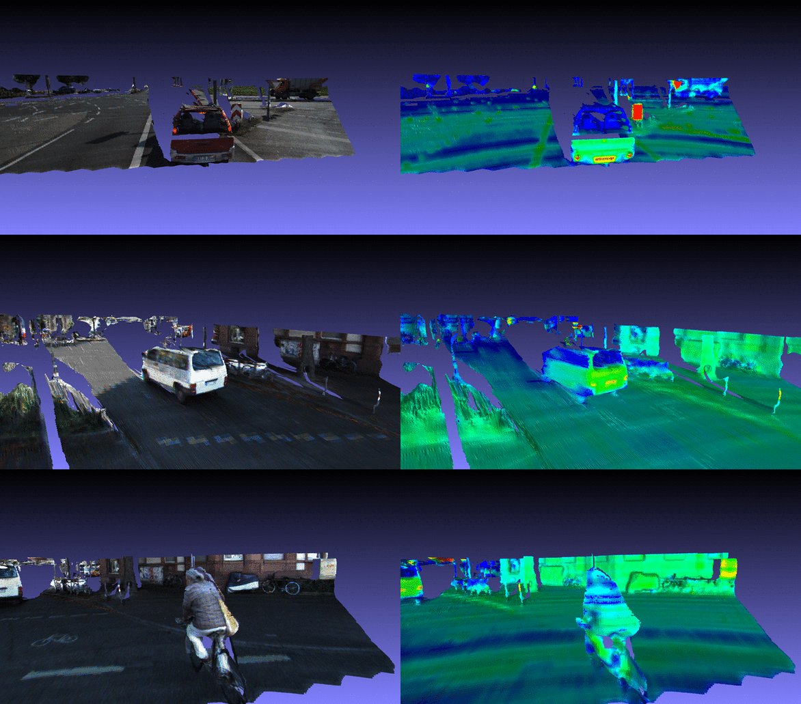

Figure 2. Densification results. Right: rgb results (color obtained from a calibrated and synchronized camera). Left: laser intensity results.

### 2. The method

#### 2.1 Hashing via Back Projection
Down to its essence, our densification is a interpolation specifically designed for Lidar. In any interpolation, <u>the very first thing we need to know is neighborhood adjacency</u>. In other words, among all points in our point cloud, which ones are near to each other, so that we could move forward to actually interpolate between them.

In an image captured by a camera, the data is represented as a 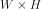 grid (per channel), which means getting neighborhood is trivially easy. However, this is not the case for our unordered Lidar data, which is originally represented as a 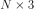 matrix, where 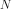 is the number of points. To give a better idea on this, one single frame of Lidar has somewhere around 10k points.

To get adjacency, one of the most brain dead solution is perhaps brute-force search. Obviously, this isn't very efficient as it takes 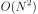 to compute all pairwise adjacency. A cleverer solution is using a kd-tree, which on average takes 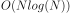 to construct and another  to compute adjacency.

Is there a even better solution for this? The answer is yes. But first, let's take a brief look at how a Lidar works:

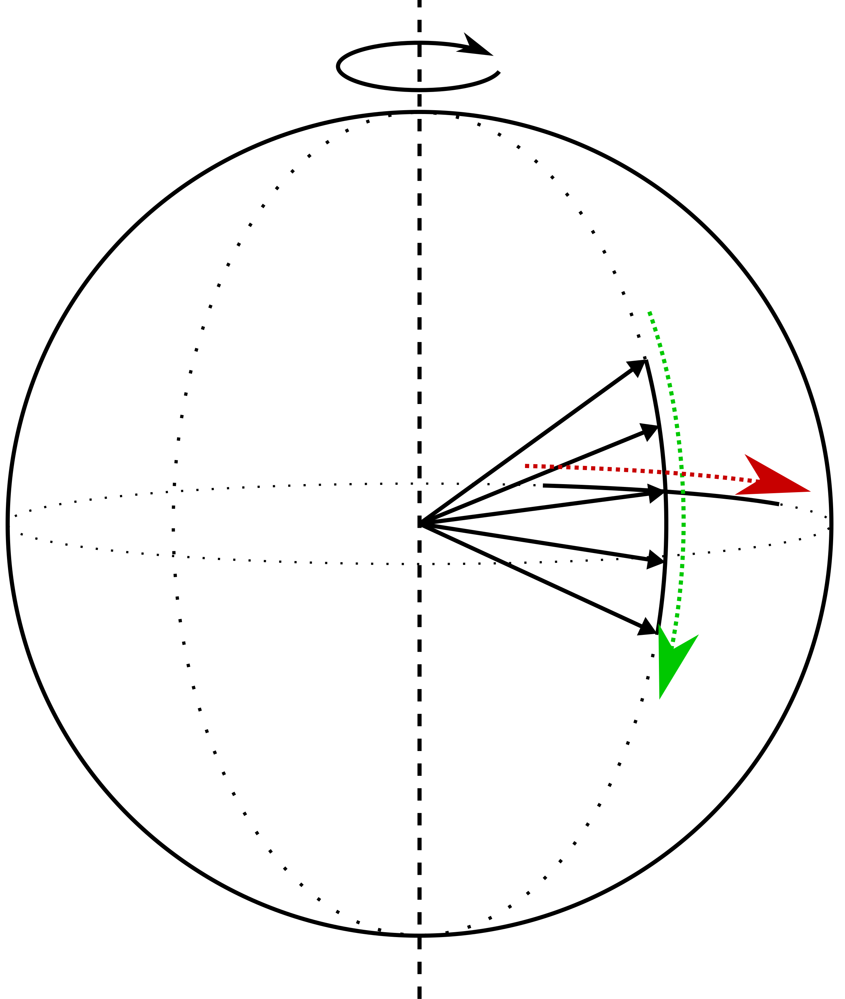

Figure 3. Lidar lasers spinning horizontally.

As we can see, a Lidar is essentially a point in space that shoots beams with various tilt and yaw. Keeping this in mind, we can easily define such 2-d polar coordinate system: 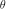 shown as the green arrow and 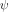 shown as the red arrow. Since different lasers points to different  and one Lidar frame scans 360-degree of  without overlapping, <u>these two polar coordinates gives us a hashing function that guarantees to find all neighbors using a window just like an image, and has no collision if with the proper resolution</u>. 

Using this, we are able to compute all pairwise adjacency with 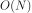, which means we save more than hundred millions of operations.

#### 2.2 Scaled Thresholding

<u>In the previous step, what we have found is not the exact neighborhood, but its super-set.</u> In other words, anything outside our window in the back projection image is guaranteed to have at least certain distance to the center point, with the proper window size specified. However, inside the window, not all points are necessarily neighbors because they could have any point-to-sensor distance value.

To address this, we simply apply a threshold on the difference of distance values between any in-window point and the center point. <u>For the threshold, we set it proportional to the center point's distance value, instead of using a constant one.</u> This is because of how Lidar data is captured, as shown below:

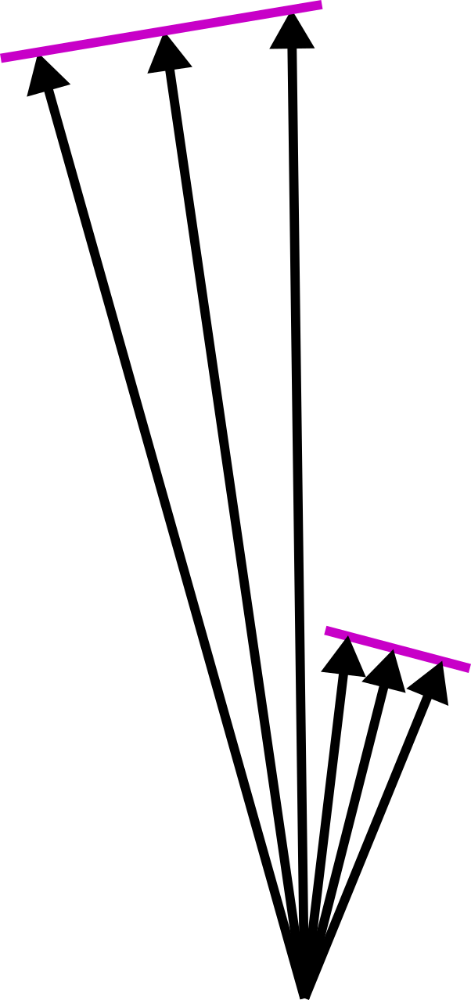

Figure 4. Top-down view of Lidar capturing two sensor-facing surfaces, one nearer and the other farther.

Let's assume for now that we have two surfaces in the scene that happen to be perfectly perpendicular to laser rays, but one is nearer and the other is farther. Our goal here, is to connect every two initially isolated points when they are pointing at the same surface, and not to connect when otherwise. 

Let's denote the Lidar angular resolution as 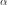, which in practice is a very small angle (0.09 degree for the widely used Velodyne HDL-64E Lidar). Let's also assume that we have two adjacent laser points detecting a common perpendicular surface with distance value 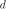. We can therefore calculate that the difference of distance value is 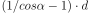, which explains our scaled threshold value.

It should be noted that, however, this thresholding does not recover surfaces that nearly sensor-parallel. As shown below:

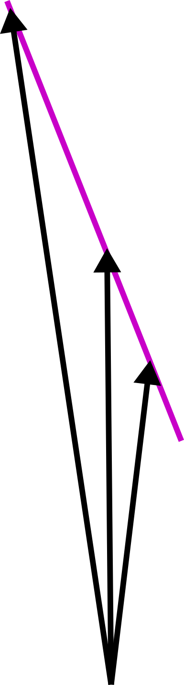

Figure 5. A surface is less likely to be recovered, as it becomes more parallel to the laser ray.

This problem is inevitable for any sensor that makes discrete measurements of the world. Given a fixed angular resolution, we could never tell if there really is an in-measurable parallel surface, or as what our method would result in, there is nothing but just empty space. With further calculation, we know that for a given angular resolution  and a given threshold value 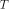 (the value we multiply  with), the minimal surface-laser angle that can be recovered is

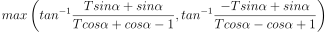

which can be plotted as

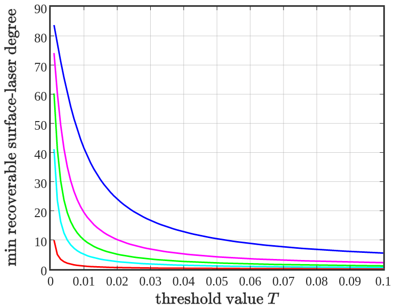

Figure 6. Minimum recoverable surface-laser angle versus different threshold value , with angular resolution  as 0.01 (red), 0.05 (cyan), 0.1 (green), 0.2 (magenta), and 0.5 (blue).

This gives some theoretical guidance on how to choose . <u>Although in practice, we can simply just trail-and-error a few times, since this only needs to be done once per Lidar.</u>

#### 2.3 Approximating the Local Hull

Now that we know which pairs of points should be connected, we still need to determine the exact regions to interpolate. <u>Essentially, this is approximation of a local hull where the center sits in, given a few known neighboring points.</u>

This is done in two steps. First, sorting neighbors by their angle relative to the center point. Second, joining the points to form a closed hull (or polygon).

Note that for the second step, we need to put some extra care for our center point. That is, after angular sorting, if the largest angle changing is less than 180 degree, we join all the neighbors. Otherwise, we join the neighbors as well as the center point, putting the center where between the two neighbors that has larger than 180 degree angle change. This may sound abstract, let's draw them out and you will instantly understand why:

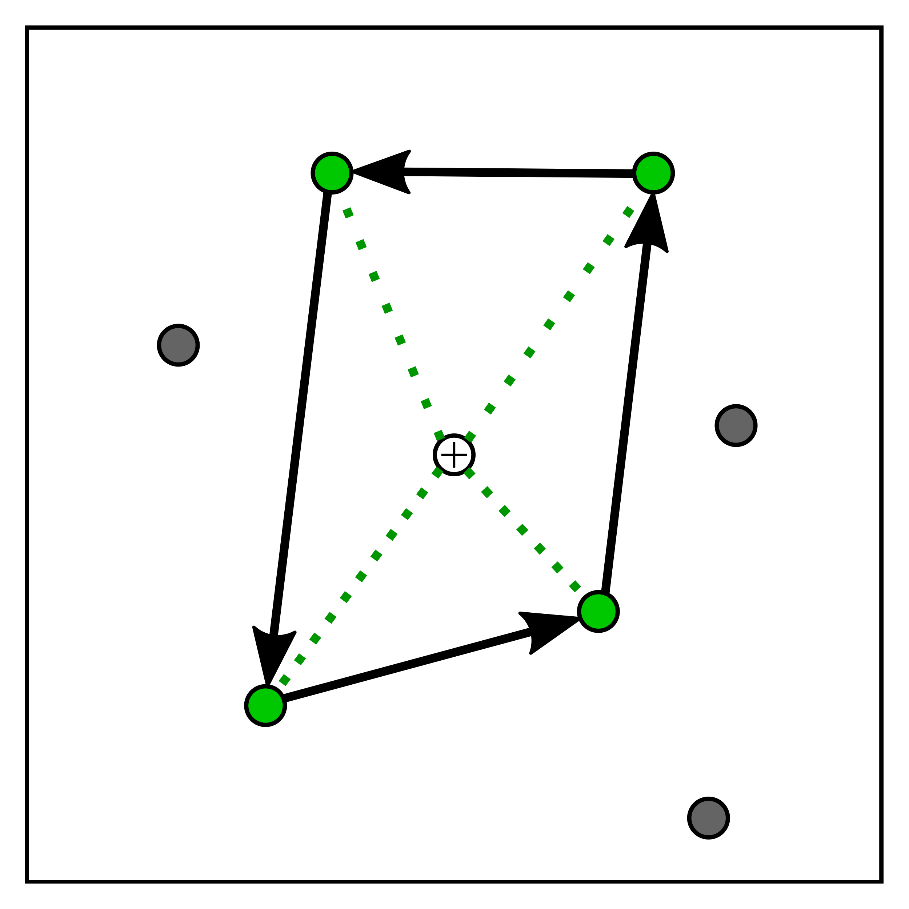
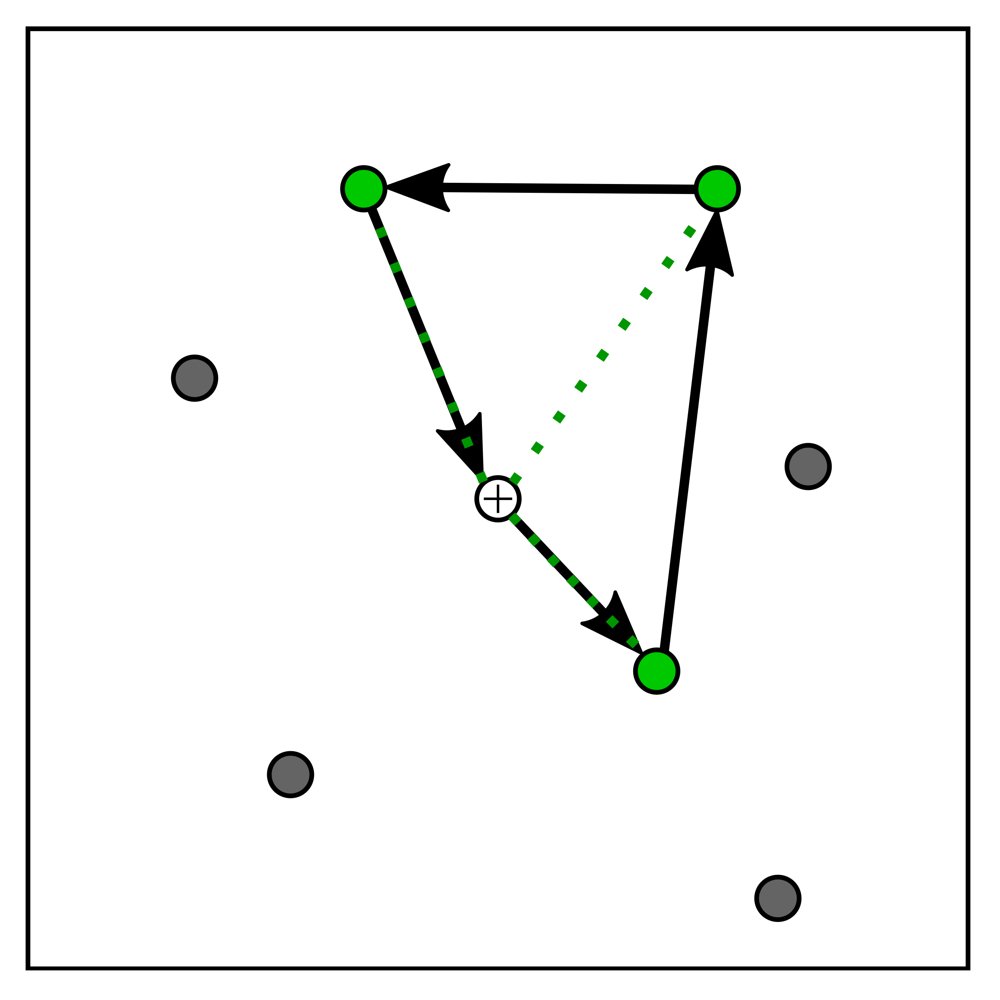

Figure 7. The two cases in the second point-joining step, neighboring points are shown in green.

#### 2.4 Interpolating Distance Values

Okay, we know the region to interpolate, but how exactly are we going to materialize it? We simply compute the interpolated the distance value inside the hull. Specifically, <u>we perform this interpolation using rasterization in the angular space, one triangle at a time</u>.

This is just the formal way of saying it. Concretely, here is how it is done. The hull is divided into several triangles, where each triangle has two neighbors and the center point as its vertices. Within the triangle, we divide it into fan-shaped angular sections. The final interpolated distance value of a point is then determined based on the section's angle with respect to the two neighbors' angles, as well as the point's distance to the center.

#### 2.5 Making the Final Mesh

We are almost done! Having finished all previous steps, what we have got is a dense, and clear-edged distance image. All we need to do now, is <u>putting it back in the 3-d space, and gluing it into a real mesh</u>.

Converting two a point in 3-d is trivial geometry, as we already have its tilt, yaw, and distance. As for generating the mesh, we apply this simple two-step process: For each point in the distance image, determine if it is neighboring to its up, down, left, and right pixel using the same scaled thresholding in 2.2. Next, generate tiny  isosceles right triangles for neighboring directions, each takes a quarter of the square-pixel in the angular distance image grid.

That's it! Now it's time to paint it with your favorite color, be it color, intensity, semantic label, or anything you prefer, and use it whatever you please to.

### 3. Performance

At maximum resolution, the Matlab prototype takes 5 second per frame (0.2 fps), the C++ version takes 70 millisecond per frame using 4 cores (13 fps). Both versions are cpu-only.

(Efficiency and reconstruction quality comparisons with two baseline methods will be added later: 1. Point Cloud Library's densification, 2. Bilateral Upsampling.)

### 4. What to use this for?

- Joint camera-Lidar Network
- Constructing ground-truth shadow labels by ray-casting on our result.